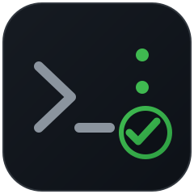

 

# BeforePush

A lightweight CLI that checks whether your Git branch is ready before pushing or opening a pull request.

## Features

- Check whether the current directory is a Git repository
- Show the current branch
- Detect uncommitted or untracked changes
- Check upstream branch configuration
- Check whether the branch is behind the target branch
- Support custom target branches

## Quick Start

```bash
pip install before-push
```
```bash
beforepush
```