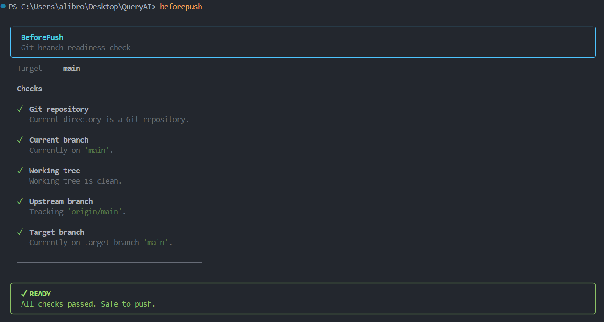

# Usage

BeforePush checks your current Git branch and working tree before you push or open a pull request.

## Basic Usage

Run BeforePush from inside a Git repository:

```bash
beforepush
```

By default, it compares your current branch against `main`.

BeforePush checks:

* Whether the current directory is a Git repository
* Which branch you are currently on
* Whether you have uncommitted or untracked changes
* Whether an upstream branch is configured
* Whether your branch is behind the target branch

## Custom Target Branch

The default target branch is `main`.

If your project uses a different target branch, you can specify it with `--target`:

```bash
beforepush --target develop
```

The target branch must already exist in the repository.

## Command-Line Options

To see all available options:

```bash
beforepush --help
```

To check the installed version:

```bash
beforepush --version
```

## Understanding the Output

BeforePush reports the result of each check using three statuses:

* **PASS**: The check passed successfully.
* **WARNING**: The check found something you may want to review, but it does not block the command.
* **FAIL**: The check failed and requires attention.

For example:



## Exit Codes

BeforePush uses exit codes so it can be used in scripts and Git hooks.

* `0` — All checks passed or only warnings were reported.
* **Non-zero** — At least one check failed.

### PowerShell

```powershell
beforepush

if ($LASTEXITCODE -ne 0) {
    Write-Host "BeforePush checks failed."
}
```

### Bash

```bash
beforepush

if [ $? -ne 0 ]; then
    echo "BeforePush checks failed."
fi
```
```powershell
beforepush

if ($LASTEXITCODE -ne 0) {
    Write-Host "BeforePush checks failed."
}
```
These exit codes allow scripts and Git hooks to detect when BeforePush finds a problem.
